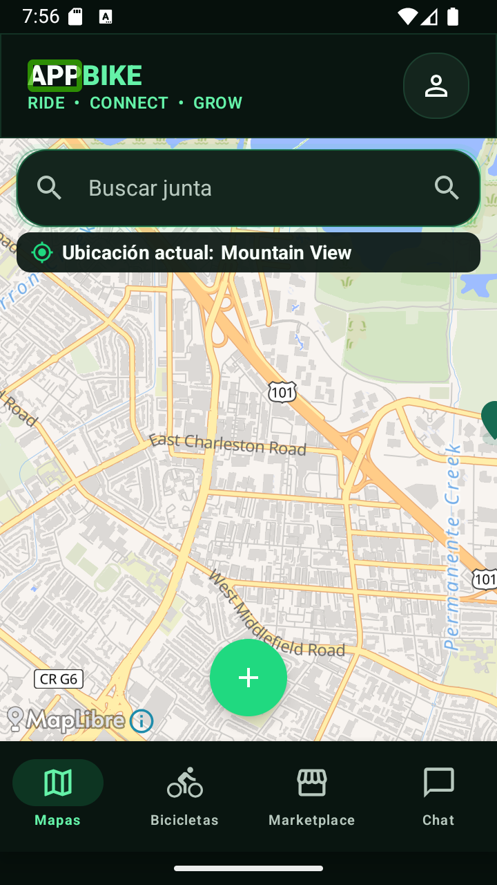
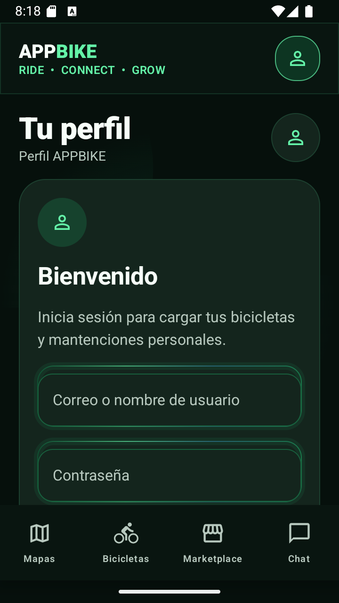
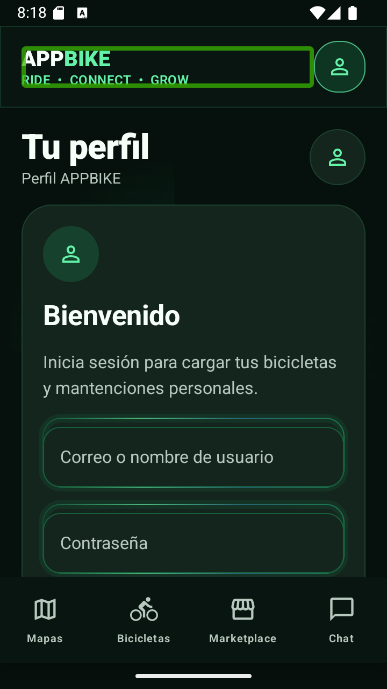
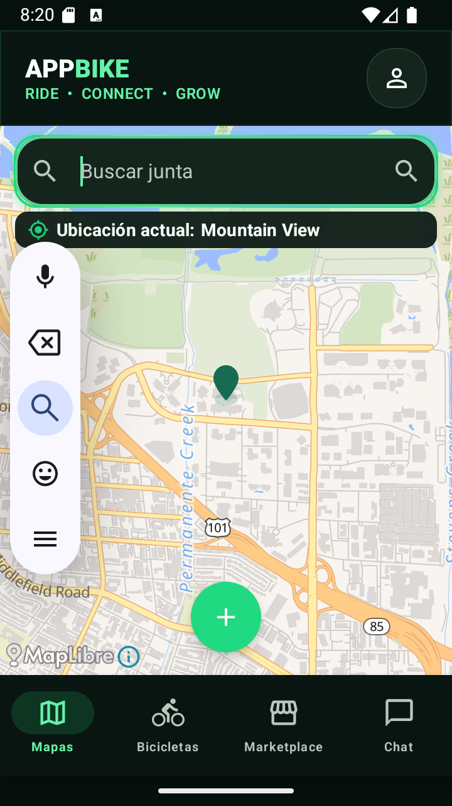
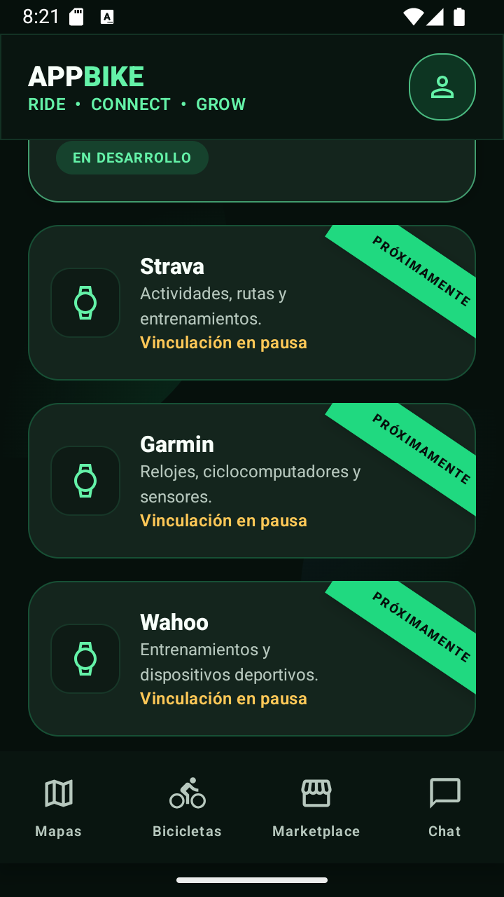

# Auditoría de accesibilidad operativa

Fecha: 2026-08-06.

## Alcance y salud

- **Semántica: saludable en el flujo comprobado.** Marca, navegación, campos,
  acciones y plataformas tienen nombres útiles.
- **Foco por teclado: saludable tras la corrección.** El buscador de Mapas ya no
  desaparece al atravesar el `AndroidView`.
- **Tamaño táctil: saludable en la muestra.** Los controles comprobados miden al
  menos 48 dp en su eje menor.
- **TalkBack: comprobación parcial.** El servicio real se activó y mostró foco;
  falta repetir gestos y pronunciación en un dispositivo físico.

## Pasos

1. **Línea base de TalkBack — En riesgo.** La marca se enfocaba empezando por
   `APP`, obligando a recorrer fragmentos decorativos por separado.

2. **Cuenta simplificada — Saludable.** Se retiraron rótulos con apariencia de
   pestaña sin acción y el formulario aparece antes.

3. **Marca agrupada — Saludable.** El rectángulo de TalkBack abarca el lockup
   completo y el árbol expone `APPBIKE. RIDE, CONNECT, GROW`.

4. **Buscador del mapa — Saludable.** El primer campo de tarea recibe foco por
   teclado y mantiene su contorno LED activo.

5. **Plataformas pausadas — Saludable.** Strava, Garmin y Wahoo conservan las
   cintas y cada tarjeta se anuncia como una unidad completa.

## Fortalezas confirmadas

- Nombres completos para Cuenta y los cuatro destinos principales.
- Login, ubicación, búsqueda, creación y estados vacíos mantienen acciones
  alcanzables por teclado cuando están habilitadas.
- Las cintas son decorativas; el mensaje `Próximamente` permanece en la semántica
  de la tarjeta sin convertirse en una acción falsa.
- El texto grande, horizontal y ancho alternativo ya cuentan con evidencia en
  las auditorías anteriores.

## Límites

- La inyección ADB no reproduce con fidelidad todos los gestos táctiles de
  exploración de TalkBack; por eso el resultado combina servicio real, foco
  visible, árbol UI Automator, teclado y pruebas Compose.
- No se evaluó la calidad de la voz ni la pronunciación audible.
- No se afirma conformidad WCAG completa.
- Los flujos privados remotos aún requieren credenciales y datos reales.

## Resultado

Las barreras reproducibles de la primera fase quedaron corregidas y cubiertas por
pruebas. La accesibilidad operativa es saludable dentro del emulador comprobado;
la meta global sigue activa hasta validar dispositivo físico y servicios externos.
