# Auditoría visual - orientación horizontal y ancho alternativo

Fecha: 2026-08-06.

## Alcance y salud

- **Salud visual: estable.** La cabecera, el contenido y la barra inferior ya no
  compiten por el orden de dibujo durante la navegación.
- **Reflow: estable en la muestra.** Se comprobó 360 dp horizontal y 540 dp
  vertical, además de la auditoría previa a 200 % de fuente.
- **Accesibilidad: parcial.** Los iconos sin etiqueta visual conservan nombres
  semánticos y no se detectaron recortes, pero falta una pasada dedicada con
  TalkBack; este informe no demuestra conformidad WCAG.
- **Funciones externas: no evaluadas.** OAuth deportivo continúa detenido y la
  prueba autenticada completa de Chat requiere credenciales reales.

## Recorrido y evidencia

1. Mapas antes: las barras ocupaban demasiada altura útil.

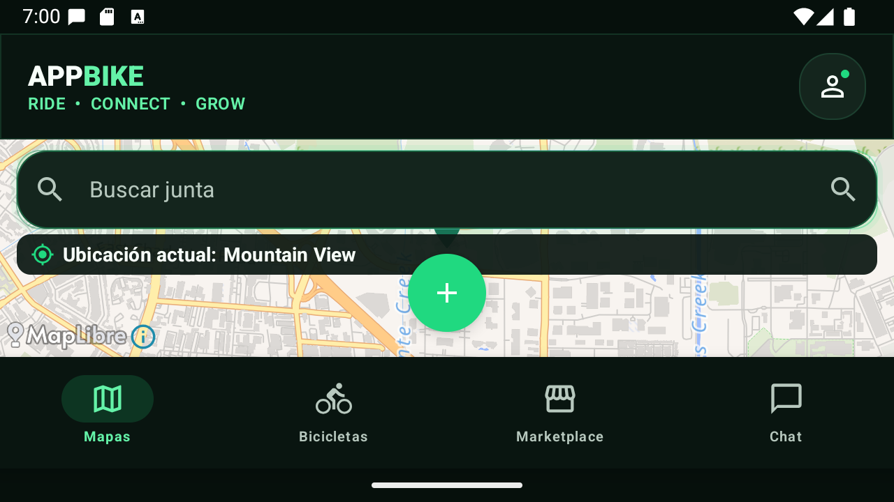

2. Bicicletas antes: el `Scaffold` anidado sumaba insets y comprimía el listado.

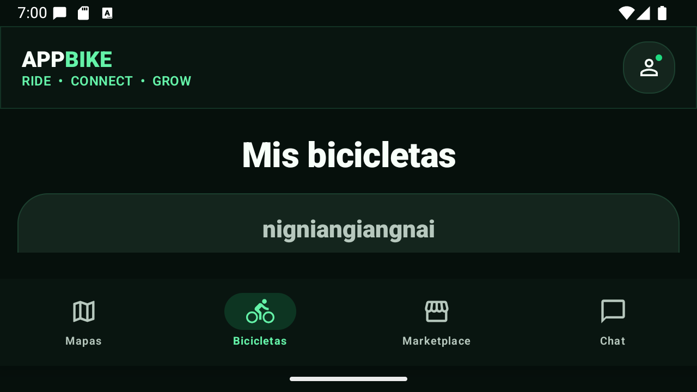

3. Marketplace antes: la composición horizontal podía perder la cabecera al
   cambiar de destino.

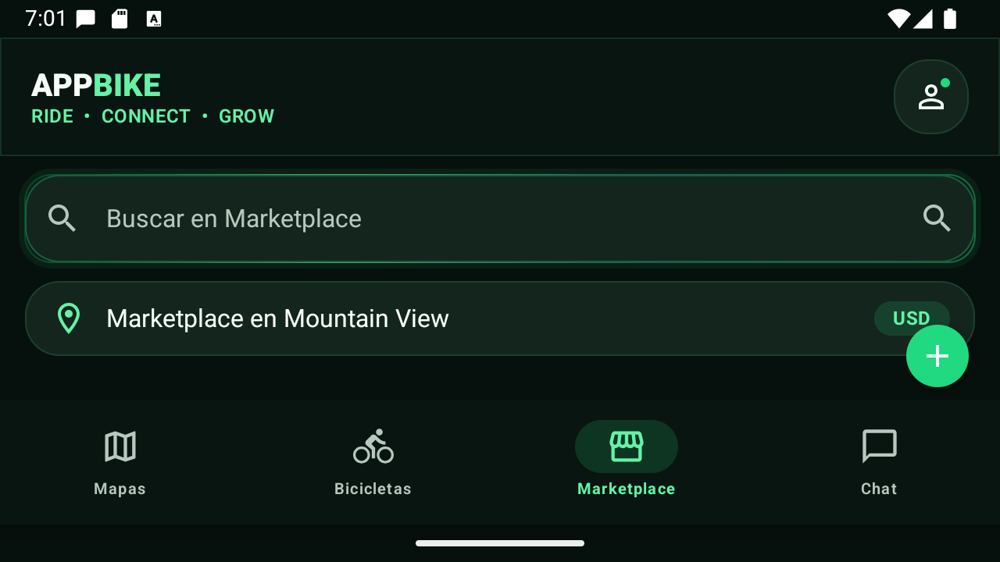

4. Mapas final: cabecera compacta, mapa dominante y navegación de 56 dp.

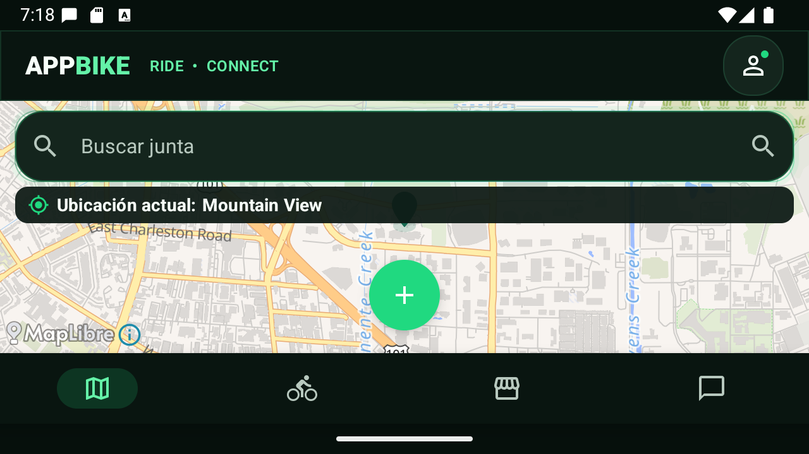

5. Bicicletas final: marca estable y mayor altura útil para las tarjetas.

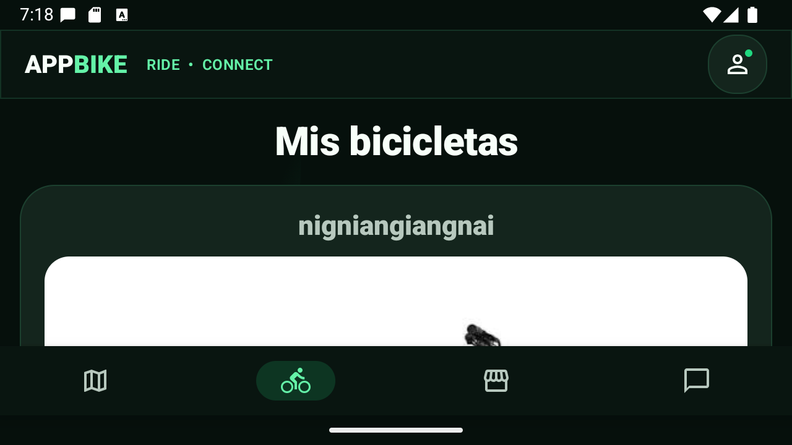

6. Marketplace final: la cabecera sigue visible después de navegar desde Mapas
   y Bicicletas.

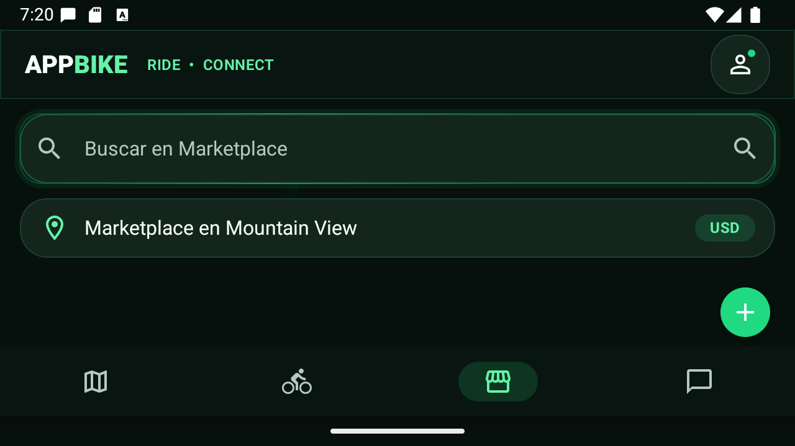

7. Chat final: cabecera, tabs y conversación visible conviven con la barra
   compacta.

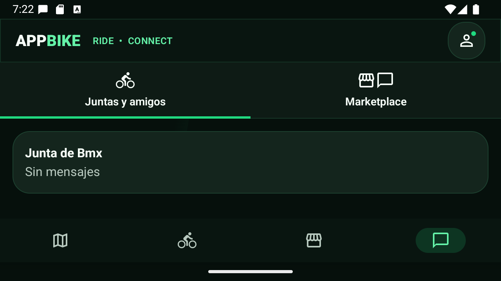

8. Cuenta final: perfil y cuenta activa mantienen jerarquía en horizontal.

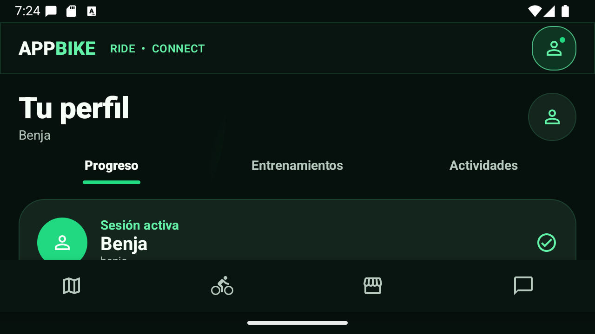

9. Sincronización deportiva: la introducción precede al contenido propio.

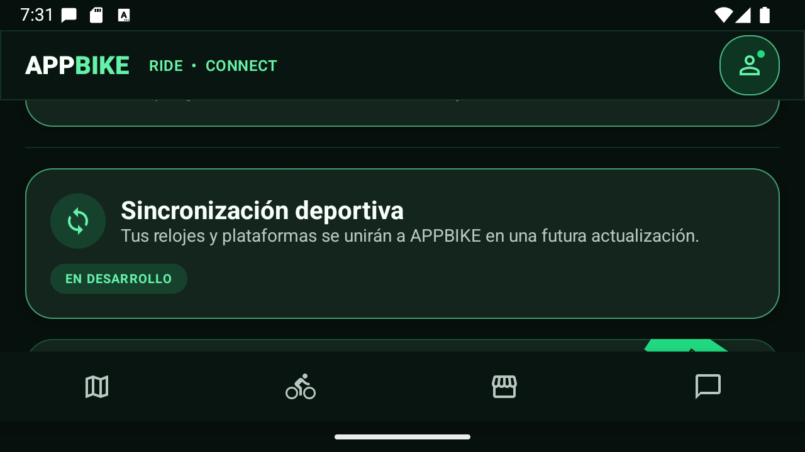

10. Strava conserva su cinta completa y el estado en pausa.

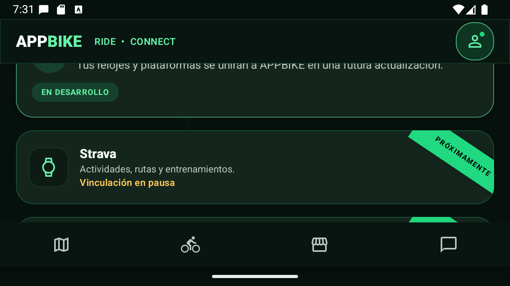

11. Garmin y Wahoo aparecen consecutivamente, antes de `Tu actividad`.

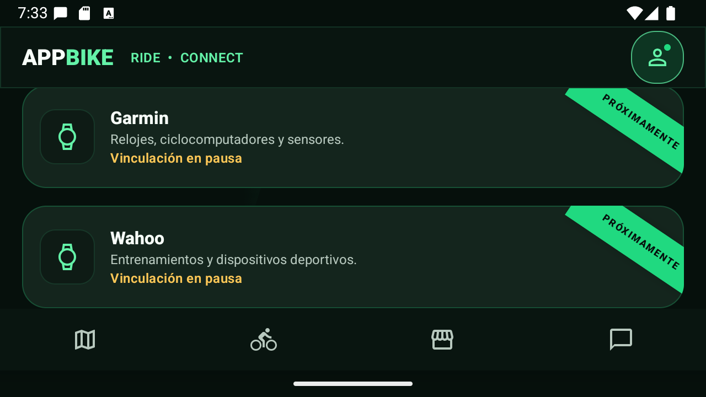

12. En 540 dp, Mapas aprovecha el ancho sin alterar el lenguaje visual.

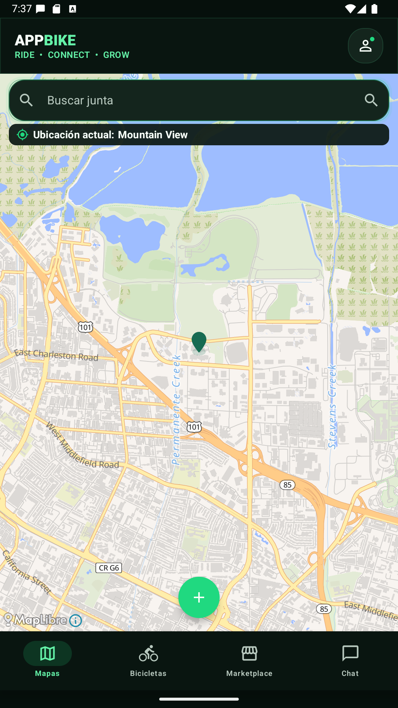

13. Cuenta a 540 dp conserva proporciones y orden de lectura.

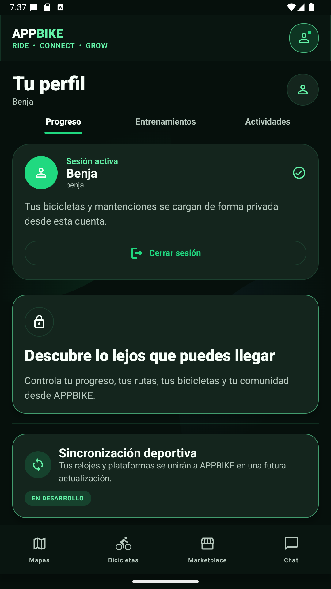

14. Las tres plataformas y sus cintas caben completas a 540 dp.

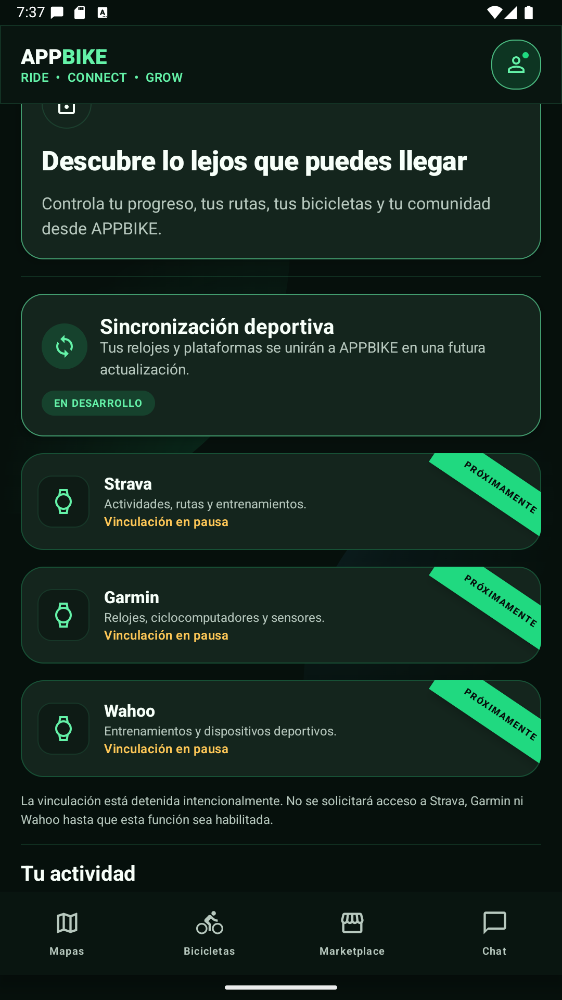

## Fortalezas

- Identidad grafito/verde LED consistente en mapa, contenido y navegación.
- Jerarquía clara: marca persistente, tarea central dominante y navegación
  secundaria compacta en horizontal.
- Las cintas diagonales comunican futuro sin sugerir que existe una acción
  habilitada.
- La semántica de navegación no depende de las etiquetas visuales horizontales.

## Riesgos y límites de evidencia

- Las capturas prueban estados concretos del AVD, no todos los fabricantes,
  tamaños ni configuraciones de accesibilidad.
- No se ejecutó TalkBack ni una auditoría con lector de pantalla.
- Los datos privados visibles proceden de la sesión local de prueba; no se
  evaluó el backend con múltiples usuarios reales en esta pasada.
- La ausencia de solapamientos visuales no sustituye pruebas funcionales de
  servicios externos.

## Resultado

Los defectos horizontales observados quedaron corregidos en las capturas finales.
La fase de diseño queda lista para revisión humana continua, con la app abierta
en el bloque deportivo; la meta funcional global permanece activa hasta completar
las validaciones externas y de accesibilidad pendientes.
